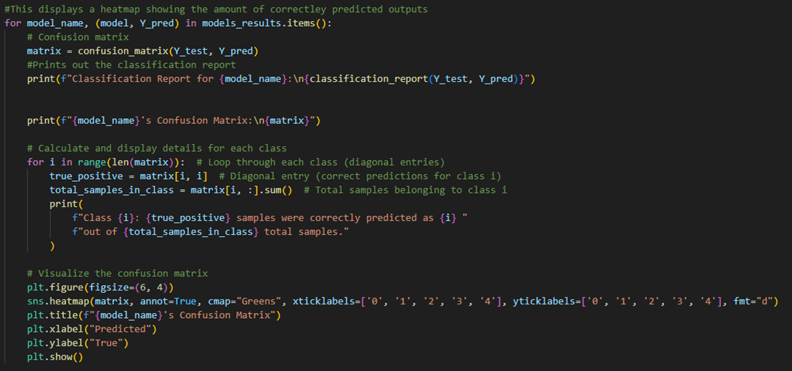

# Predicting-Student-grades
Part of introduction to Ai module where I developed a machine learning model that is given a data set about students and trains a model on classification to predict student grades.

## Section 1 – Data Collection and Preprocessing
### 0.	Brief description of the dataset
Data set - https://www.kaggle.com/code/annastasy/predicting-students-grades/input
The dataset I have used is based on student performance and will predict grade class making the prediction classification. The idea is to use the age, gender, ethnicity parent’s education, study habits, parental involvement and extracurricular activities of students to predict their grade class (0 : A, 1 : B, 2 : C, 3 : D, 4 : F), which is the target variable, this can then be used to see which students are potentially underperforming and could be used to enable them to get help to result in higher academic performance.
### 1.	Handling any missing values and outliers.
I started off by using the pandas library to read the CSV file and store it in the variable named data set. I then dropped StudentID as shown in figure 1. StudentID was dropped as it was not relevant to calculating the grade classification. There is an argument to be made that age should be dropped from the dataset as well, but I have kept it as it can represent knowledge, as younger people may not have been taught as much as older people an example of this is in the schooling system.  
  
**Figure 1.**
I used the .fillna method from the pandas library on each column that hasn’t been dropped to fill in any gaps in the data set as shown below in figure 2. I used a mixture of mode and median depending on the context of the column. Age, StudyTimeWeekly, and Absences were all filled in using median as it provides a better representation of the typical values in the data set and the rest used the mode as the picking the most common item fitted better. This step is important as some machine learning models such as linear regression and decision trees need the data set to be complete and gaps can cause errors, also gaps in the data set can cause biases in the overall result.  
  
**Figure 2.**
### 2.	Encode categorical variables.
The dataset didn’t have any categorical variables in it as they had already been encoded previously. I did however, code an example of what would be required if the dataset had categorical variables which is shown below in Figure 3. This is important as most machine learning algorithms work with numbers and allows a wider range of algorithms to be applied to it.  
  
**Figure 3.**
### 3.	Splitting the data into training and testing sets.
The data was split 70% to train and 30% to test, this is important as more data you give to train, the parameter estimates will have less variance. Since my data set is large it makes sense to give a larger split towards training to allow the model to learn more effectively. Figure 4 below shows how I implemented this using the pandas library to create two variables of the dataset ‘X’ that contained everything but the target variable and ‘Y’ that only contained the target variable, I then used the ‘train_test_split’ function from scikit-learn and passed the two variables and the test percentage size, this was then stored in variables as shown in the figure.  
  
**Figure 4.**

Figure 5 shows the code I used to rebalance the dataset this was needed as it didn’t contain enough minority class data (low performing students) which in turn could have resulted in biases towards the majority classes (high performing students). Rebalancing could also increase the accuracy in predictions towards the minority classes. I implemented this using over sampling which is where you increase the number of data entries that belong to minority class, I used SMOTE which is Synthetic Minority Oversampling Technique from a library called imblearn to rebalance my dataset.  
  
**Figure 5.**
## Section 2 – Model Selection and Training.
### Selecting models
The two algorithms I have chosen are Random Forest and Xgboost. I chose these algorithms as they all work with classification and supervised problems. Random Forest will create multiple trees and then ensemble them allowing for decreased variance and overfitting but could increase biases. Xgboost is scalable and has high accuracy by using gradient boosting which is where you try and create a strong classifier using weak classifiers by creating multiple trees and each one trying to correct any errors made by the previous ones. Boosting can increase variance which can lead to overfitting. Each algorithm has been optimised using different hyperparameters as shown in figure 6, this was implemented by using a dictionary.   
   
**Figure 6.**
   
**Figure 7.**
### Hyperparameter tuning
For tuning hyperparameters for each of my algorithms I store them in a dictionary then loop through each of them and return the hyperparameters with the best accuracy.
#### Random Forest
 Random forest has 3 hyperparameters: number of trees (‘n_estimators’), maximum depth of the trees (‘max_depth’), minimum number of samples to split a node (‘’min_samples_split’).
##### Number of trees
The more trees usually means more accuracy as it uses the average of all of them, this is true up to a point where it doesn’t make a difference. In figure 6 I have chosen [20, 50, 100, 200] as the number of trees.
##### Maximum depth of the trees
This is the max depth between the root node and the leaf nodes. By limiting the depth, it allows me to prevent overfitting and ensures that the trees don’t learn specific patterns. In figure 6 I have chosen [none, 10, 20] as the maximum depths.
##### minimum number of samples to split a node
This is the minimum number of samples before a node can be split into child nodes. By increasing the minimum required it reduces overfitting. In figure 6 I have chosen [2, 5, 10] as my minimum number of samples to split a node. 
#### XgBoost
XgBoost has 4 hyperparameters: number of trees (‘n_ estimators’), step size per iteration (‘learning_rate’), maximum depth of a tree (‘max_depth’), Proportion of data for each tree (‘subsample’).
##### Number of trees
This controls the number of trees that are used to create the final model. The more trees usually allow for more accurate fitting, however too many trees can result in overfitting and a small number of trees can result in underfitting. In figure 6 I have chosen [25, 50, 100] as the number of trees.
##### step size per iteration
This determines how much each trees predictions can influence the final tree. A large learning rate means that each tree has a strong influence, however a low learning rate can help in reducing over fitting. There is a link between number of trees and this as with a low learning rate usually you’d need to increase the number of trees. In figure 6 I have chosen [1, 0.1, 0.01] as the step sizes.
##### maximum depth of a tree
This is the same as in Random Forest. In figure 6 I have chosen [3, 5, 7] as the number of trees.
##### Proportion of data for each tree
This determines the amount of training data that is sampled to train each tree. A large number means most of the data will be used to train each tree which can cause over fitting and smaller values can help in reducing over fitting and could increase generalisation. In figure 6 I have chosen [0.8, 1] as data per tree.
### Training
I use GridSearchCV to train the data set and tune the hyper parameters using the parameters given in figure 6. I also use 5-fold cross validation as shown in figure 7, this allows me to be more confident in the results being consistent and not a fluke by evaluating it multiple times. I have also used ensemble learning to predict grade class using all the algorithms as shown in figure 8 this uses the boosting from XgBoost and the bagging from Random Forest. Ensemble learning should allow the predictions to be more accurate.  
   
**Figure 8.**
## Section 3 – Prediction and Evaluation.
### Prediction
Figure 9 shows the results list where I stored the predictions as well as the best hyperparameters and their best cross validation score. The predictions were performed within this list and stored there this allowed them all to be done in one for and to be accessed at any time, making the code easier to read.  
   
**Figure 9.**
### Performance metrics
Figure 10 shows the code I used to create the performance metrics. This uses the classification_report method from the Scikit library to calculate the precision, recall, F1-score. The F1-score is calculated 2 x ((precision x recall) / (precision + recall)). Precision is calculated True positives / (True positives + False positives). Recall is calculated True positives / (True positives + False negatives).  
   
**Figure 10.**   
   
**Figure 11.**   
   
**Figure 12.**   
   
**Figure 13.**
### Evaluation
All the datasets have an accuracy above 90% with random forest being the highest at 94%. 
#### Precision
Random Forest has the best average precision out of all the algorithms meaning that overall, it produces the least number of false ‘high performing’ students. However, the other algorithms are only 0.01 behind which is still a very good outcome as for every 100 items its only giving around 7 students who was predicted as false ‘high performing’ but didn’t. Although the error rate is low these inaccuracies could lead to misplaced expectations if used with actual students as it can lead to students believing that they will do better than they will.
#### Recall
Random Forest has the best average recall overall, meaning it accurately predicted a large percentage of ‘low performing’ students aided by the balancing of the dataset to prevent biases against the majority class ‘high performing’ students. Again, the other algorithms are only 0.01 behind with their recall score still meaning that for 100 students 7 could be missed and predicted as ‘high performance’ resulting in them potentially not being able to get the academic help they need. Ultimately, the recall scores are still very good.
#### F1-score
To no surprise Random Forest having the best precision and recall means it also has the best F1-score. This shows that the precision and recall are well balanced with a 0.94 average meaning that is not missing out on ‘low performing’ students nor over-predicting them. The other algorithms are only lower again by 0.01. For all of the algorithms the average F1-score is perfectly balanced as precision and recall are equal this means that it doesn’t prioritise either over the other. 
## Section 4 – Visualisation and Insights.
### Confusion matrices
These matrices show the amount of each class that are correctly predicted.
#### Code
   
#### Results
  
  
  
#### Analysis
The results above show that the dataset is well balanced and showing where it went wrong when predicting the results. At first look at the matrices there are 2 instances of errors in predicting that are consistent and happened a few times these are trying to predict a true result of 1 as four and true result of 16 as 2. The graphs also show the ensemble model off quite well and how it is made up from the other two models as for the most part its predictions are in between that of the other two for example its correct predictions for 2 is 320 with Xgboosts and Random Forests being 318 and 322 respectively. It also shows that the ensembled model predicted more of class 0 than the other two algorithms and less of class 4 showing that for the use case of trying to identify underperforming students it’s less effective.
### Normalised Confusion matrices
These matrices show the accuracy of predictions per each class.
#### Code
   
#### Results
   
  
  
#### Analysis
The results above show similar results to the non-normalized confusion matrices. With that being that the data set is well balanced, and each algorithm has similar errors. However, with the exception of ensembled they show that there are slight biases to the extreme classes since those are the most accurate, with ensembled it show slight biases to class 0 which is the ‘high performing’ students.
### Feature importance
This shows the most important feature for Random Forest.
#### Code
   
#### Results
   
#### Analysis
The results of this graph with GPA being the most important feature isn’t too surprising as GPA is very similar to grade class. Music being second also makes sense as playing a musical instrument is known to be very good for your cognitive function and can increase your memory, sports is like music with how it is known to help your health which in turn can improve your academic performance. Surprisingly though tutoring is presented as being of the same importance as volunteering and parental education. This could be showing that tutoring outside of school is as effective as thought and that volunteering could be just as impactful for increasing academic performance. However, I am interested in what the results would be if we only kept the 5 most important features; GPA, Music, Gender, Sports, and volunteering. After trailing this accuracy decreases for all classes but 4 which the ‘low performing’ students’ class, this shows that although these features aren’t as important, they are important enough to distinguish the top performing students getting A’s and B’s.
